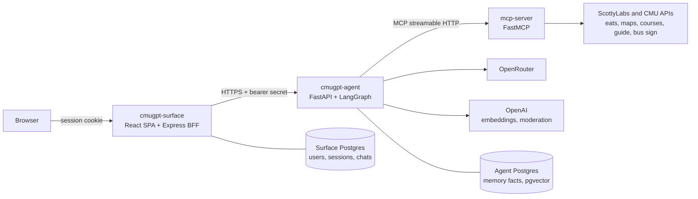

# RFC 0001: System Architecture

- **Status:** Draft
- **Author(s):** @krishsax
- **Created:** 2026-09-26
- **Updated:** 2026-09-26
- **Affects:** cmugpt-surface, cmugpt-agent, mcp-server

## Overview

This RFC records Bark's architecture: three independently deployed services (the Surface, the Agent, and the MCP server), what each one owns, the contracts between them, and the development environment they share. RFCs 0002 (Agent), 0003 (Surface), and 0004 (MCP Server) cover each service in detail and build on this document.

## Motivation

Bark grew as three repositories that were built at different times by different people. Each repository documents itself, but nothing documents how they fit together. As a result, cross-service changes land half-finished. For example, the MCP server publishes a `bus` tool group that neither the Agent nor the Surface knows about (see RFC 0004). Contributors also have to piece together which service owns what by reading three codebases.

## Goals

- Define each service's responsibility and the data it owns
- Document the Surface to Agent and Agent to MCP contracts and their trust boundaries
- Set rules for evolving those contracts without breaking a running deployment
- Define the development environment and secrets access that all three repositories share

## Non-Goals

- The internal design of each service (RFCs 0002-0004)
- Prompt design, model choice, or UI design
- Changing Kennel, the shared devenv module, or OpenBao

## Detailed Design

### Components

| Service | Responsibility | RFC | Production URL |
|---|---|---|---|
| Surface | Andrew ID sign-in, chats and messages, preferences, streaming answers to the browser | 0003 | `bark.scottylabs.org` (web), `api.cmugpt.com` (API) |
| Agent | Input checks, tool selection, running the model, output checks, per-user memory, token budget | 0002 | `api.cmugpt-agent.scottylabs.org` |
| MCP server | Wrapping public campus data sources as MCP tools | 0004 | `api.mcp-server.scottylabs.org` |

All three deploy through Kennel from their own repository. Kennel builds the Nix package defined in each `flake.nix` and resolves secrets from OpenBao using the profile that matches the branch: `main` to `prod`, `staging` to `staging`, `dev` to `dev`, and pull requests to `preview`.

### Request flow

1. The browser sends a message to the Surface, authenticated by the Surface's session cookie.
2. The Surface stores the user message, then calls `POST /agent/respond/stream` on the Agent with the query, prior turns, a hashed user id, the chosen model, and any tool groups the user has disabled.
3. The Agent checks limits and moderation, selects tools, recalls memory, and runs the model, calling MCP tools as needed.
4. The Agent checks the answer and streams Server-Sent Events back to the Surface.
5. The Surface relays the events to the browser and stores the final assistant message. The Agent extracts durable facts about the user in the background.

### Contracts

**Surface to Agent (HTTP).** The Agent's routes are `/agent/respond`, `/agent/respond/stream`, `/agent/title`, `/memory/{user_id}` (list and clear), `/memory/{user_id}/items/{kind}/{item_id}` (delete), and `/api/health`. The JSON uses snake_case. RFC 0002 defines the request fields and stream events.

**Agent to MCP (MCP over streamable HTTP).** The Agent discovers tools from `MCP_SERVER_URL` (for example `https://api.mcp-server.scottylabs.org/mcp`). RFC 0004 defines tool naming and tool groups.

### Trust boundaries and identity

- **The browser never talks to the Agent.** Only the Surface knows the Agent's URL and the bearer secret.
- **`AGENT_SHARED_SECRET`** authenticates the Surface to the Agent. Both services refuse to start in production when it is missing or shorter than 32 characters. It must never reach browser-visible configuration.
- **User identity is pseudonymous past the Surface.** The Surface sends `oidc:<sha256("oidc:" + sub)>`, never the raw OIDC subject, email, or Andrew ID.
- **The MCP server is public and unauthenticated.** It serves only public campus data and stays stateless. Tool arguments can contain fragments of user queries, so the MCP server does not log or store them beyond normal request logs.

### Data ownership

| Data | Owner | Store |
|---|---|---|
| Users, sessions, OIDC login state | Surface | Surface Postgres |
| Chats, messages, preferred model | Surface | Surface Postgres |
| Long-term memory facts | Agent | Agent Postgres with pgvector |
| Daily token usage | Agent | SQLite file (`TOKEN_USAGE_DB`) |
| Campus data | Upstream APIs | None. The MCP server is a pass-through. |

The Surface never reads the Agent's database. Memory management in the UI goes through the Agent's `/memory` routes.

### Development environment

All three repositories use devenv with Kennel's shared module (`inputs.scottylabs.devenvModules.default`, `scottylabs.enable = true`). The module provides `bao` and `secretspec`, sets `BAO_ADDR`, and exports resolved secrets into the shell. Repositories that need Postgres enable `scottylabs.postgres` with `pgvector`.

**Access.** Dev secrets live in OpenBao. Read access comes from membership in the `slai` team in governance (`data/teams/slai.toml`), which adds the member to the team's Keycloak group. Before using devenv, a contributor:

1. Creates a git.cmu.dev account and SSH key ([Forgejo Setup](https://docs.scottylabs.org/scottylabs/onboarding/forgejo-setup.html))
2. Joins `slai` through a governance PR ([Contributing](https://docs.scottylabs.org/scottylabs/onboarding/contributing.html))
3. Installs Nix and devenv
4. Logs in once per machine with `nix run git+https://git.cmu.dev/ScottyLabs/kennel#login`

The shell resolves secrets as it starts, so it fails until step 4 is done. The token renews on each shell entry and expires after 90 days without use.

**Secrets.** Each repository that needs secrets commits a `secretspec.toml` with Kennel's standard providers (`local`, `openbao`, `openbao-ci`) and the profiles `default`, `dev`, `prod`, `staging`, `preview`, and `ci`. The `dev` profile resolves through `openbao`, and every secret it requires has a value in OpenBao, so a team member needs no `.env`.

**Without Nix.** Every README also documents a path without Nix: install the toolchain directly and either supply personal keys in a `.env` or use `bao` and `secretspec run -P dev`.

**Local ports.** Each service has a fixed port so that all three can run together:

| Service | Process | Port |
|---|---|---|
| Surface | Vite (web) | 4173 |
| Surface | Express API | 3001 |
| Surface | ricochet OAuth relay | 8090 |
| Agent | FastAPI | 5055 |
| MCP server | FastMCP | 5050 |

By default each service uses production for its dependencies. To run the whole stack locally, set `AGENT_API_URL=http://127.0.0.1:5055` in the Surface and `MCP_SERVER_URL=http://127.0.0.1:5050/mcp` in the Agent, and leave `AGENT_SHARED_SECRET` empty in both (or set the same value in both).

## Alternatives Considered

- **One monorepo for all three services.** It would make cross-service changes atomic. We kept separate repositories because each service deploys independently through Kennel with its own secrets profile, and the MCP server is useful beyond Bark.
- **The Agent calling campus APIs directly instead of through MCP.** It would remove a hop and a service. But MCP keeps the data tools reusable by other clients, lets tool authors work without touching agent code, and provides standard tool discovery.
- **The browser calling the Agent directly.** It would avoid proxying the stream. But it would expose the Agent and its model spend to the internet and need a second auth integration. The BFF keeps one auth boundary.
- **Docker Compose for local development.** It is familiar to more people, but it duplicates what Kennel's devenv module provides and would drift from how production is built.

## Implementation Phases

This RFC documents the existing system. When it is accepted:

- Link this RFC from each repository's README
- Bring each README's setup section in line with the Development environment section above
