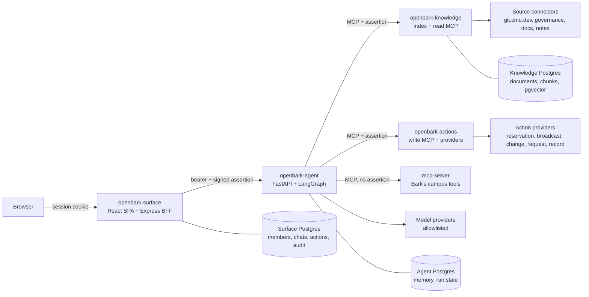

# RFC 0001: System Architecture

- **Status:** Draft
- **Author(s):** @qianxuege
- **Created:** 2026-10-03
- **Updated:** 2026-10-03
- **Affects:** openbark-surface, openbark-agent, openbark-knowledge, openbark-actions

## Overview

This RFC records OpenBark's architecture: four independently deployed services, what each one owns, the contracts between them, the extension points that let other projects add knowledge sources and actions, how OpenBark federates MCP tool servers including Bark's, and the development environment they share. OpenBark is an internal assistant for ScottyLabs members and a shared platform the team builds modules on top of. RFCs 0002-0006 cover each piece in detail and build on this document.

## Motivation

OpenBark's shape is Bark's: a Surface that owns members and chats, an Agent that owns model work, and MCP servers that own data access. That is a deliberate reuse, and it means the Bark RFCs are the right starting point and the team's existing habits transfer.

Three things make it more than a copy.

**The trust posture is inverted.** Bark serves public campus data to anyone who signs in with an Andrew ID. OpenBark answers from private institutional material and takes privileged actions on a member's behalf. Three decisions that bark RFCs 0001, 0003, and 0004 argue for in detail are wrong here: pseudonymous identity past the Surface, an unauthenticated read-only tool server, and unrestricted model routing. If the reversals are left implicit, someone will copy the Bark reasoning into a system where it no longer holds.

**It is meant to be extended, not finished.** The features the team wants first (room booking, mass emailing, reminders, task lists, events, opening pull requests on git.cmu.dev) are useful examples, not the deliverable. The deliverable is a framework where each arrives as a module against a declared contract, and where a module can be swapped without touching the Agent.

**It consumes tool servers it does not own.** OpenBark should answer campus questions using Bark's existing `mcp-server` rather than re-wrapping CMUEats and CMUMaps, while also publishing its own internal tools. Bark's Agent reads exactly one `MCP_SERVER_URL`, so this is new ground and the federation rules need stating.

## Goals

- Define each service's responsibility and the data it owns
- Define the contracts between them, including the action and approval contract that Bark has no equivalent of
- Define how the Agent federates several MCP servers, including ones OpenBark does not own
- Define the four extension points that make OpenBark modular, and point to the RFC that specifies each
- State the trust boundaries, and record where and why they differ from Bark's
- Define the development environment, which OpenBark shares with the rest of ScottyLabs

## Non-Goals

- The internal design of each service (RFCs 0002-0006)
- Any specific knowledge source or action provider. Room booking and mass emailing are specified as capability classes in RFC 0006; a concrete provider for either is a follow-up RFC
- Prompt design, model choice, or UI design
- Changing Kennel, the shared devenv module, OpenBao, or governance
- Changing Bark. OpenBark consumes `mcp-server` as it is

## Detailed Design

### Services

| Repository | Responsibility | Home RFC | Also constrained by | Port |
|---|---|---|---|---|
| `openbark-surface` | Sign-in, authorization, chats, approvals, audit | 0003 | 0004, 0006 | 3002 / 4174 |
| `openbark-agent` | Planning, retrieval, model execution, verification, memory, run state | 0002 | 0004, 0005, 0006 | 5056 |
| `openbark-knowledge` | Ingesting sources, retrieval, and the read MCP tools over them | 0005 | 0004 | 5053 |
| `openbark-actions` | Approval-gated write MCP tools and their providers | 0006 | 0004 | 5052 |

All four deploy through Kennel from their own repository, as Bark's three do, with secrets resolved from OpenBao using the profile that matches the branch.

A repository has one home RFC, which designs it, and is constrained by the contract RFCs it participates in. The two kinds read differently and change at different rates. A home RFC is a service's internal design and is revised whenever that service is reworked. A contract RFC is an agreement between services, and revising it means revising every participant, so it should be stable and its Affects list is deliberately long.

RFC 0004 is the contract RFC that reaches furthest, because the MCP tool interface is shared by everything that publishes or consumes a tool: naming, grouping, classification, authentication, and federation are identical for a search tool and a send tool. What sits behind those tools is not, which is why retrieval is specified in RFC 0005 and actions in RFC 0006 rather than in RFC 0004. A tool server therefore appears in two RFCs: the contract it implements, and the domain it serves.

This is Bark's pattern, not a new one. `cmugpt-agent` spans bark RFCs 0001, 0002, and 0004, and bark RFC 0004 lists all three Bark repositories in its Affects because one tool contract constrains all three. OpenBark adds a fourth participant and a second contract RFC for actions.

### Four repositories

OpenBark keeps Bark's separate-repository model, for Bark's reason and two of its own.

**Bark's reason, now demonstrated.** Bark RFC 0001 justifies splitting partly because "the MCP server is useful beyond Bark." OpenBark consuming `mcp-server` is that claim coming true: a tool server in its own repository, with its own deploy and no dependency on its first consumer, is reusable by a second consumer at no cost.

**Commit access is a control.** `openbark-actions` is the service that can email the organization. Its own repository can have a smaller set of people who can merge to it than `openbark-surface` does, enforced by Forgejo and described in governance. In one repository anyone who can change the chat UI can change what a broadcast does. This is the cheapest real security control in this RFC set, and it exists only if the write service is separate.

**It keeps extensions optional as packages.** A source connector (RFC 0005) or an action provider (RFC 0006) can be installed from its own repository rather than merged into its host, so a module author needs no commit access to OpenBark's core. Splitting preserves that option; whether to use it from the start is an open question below.

The cost is real. A contract change that spans services is several pull requests in a deploy order, shared types must be duplicated or published, and a rename is a multi-step migration. Bark RFC 0004 documents where that leads: the `bus` group shipped to `mcp-server` and never reached the Agent's `TOOL_GROUP_LABELS` or the Surface's `AGENT_TOOL_IDS`, so five tool schemas went to the model on every turn and nobody could switch them off. Every contract in this RFC set therefore carries a test that fails when its two sides disagree, which is the obligation that comes with four repositories.

### Request flow

**Read path.** A question with no side effects.

1. The browser sends a message to the Surface, authenticated by the Surface's session cookie.
2. The Surface authorizes the request, stores the member message, and calls the Agent with the query, prior turns, and a signed assertion carrying the member's subject and roles.
3. The Agent plans, retrieves from `openbark-knowledge` with the assertion's roles applied as a filter, runs the model, and calls read tools as needed.
4. The Agent verifies the answer, including that every citation resolves, and streams Server-Sent Events back to the Surface.
5. The Surface relays the events to the browser and stores the assistant message with its citations.

**Action path.** A request that changes something outside OpenBark.

1. Steps 1-3 as above. The Agent determines that answering requires an action and calls the provider's `preview` on `openbark-actions`.
2. The Agent emits an `action_preview` event describing exactly what would happen, and the run suspends. Nothing has changed yet.
3. The Surface stores a pending action and shows the preview. The run stays suspended until a member with the required permission approves or rejects it, or it expires.
4. On approval the Surface calls the Agent to resume. The Agent executes with an idempotency key and records the outcome in the audit log.
5. The Agent resumes the answer with the result.

The Agent never executes an action without a recorded approval. RFC 0006 defines the lifecycle, RFC 0002 the suspension.

### Contracts

| Contract | Between | Defined in |
|---|---|---|
| Chat and streaming HTTP API | Surface, Agent | 0002 |
| Signed user assertion | Surface, Agent, tool servers | 0003 |
| Action preview, approval, and execution | Surface, Agent, Actions | 0006 |
| MCP tool naming, groups, and classification | Agent, Knowledge, Actions | 0004 |
| Retrieval query and result, including provenance | Agent, Knowledge | 0005 |

Contract changes follow bark RFC 0001's rule: deploy the callee first, and both sides tolerate the other's older version for one release. Every contract above has a test that fails when the two sides disagree, which is the obligation that comes with four repositories.

### MCP federation

Bark's Agent builds a `MultiServerMCPClient` with a single entry named `cmu` from `MCP_SERVER_URL`. The adapter library is already multi-server; Bark simply configures one. OpenBark configures three, so federation is a configuration change rather than a new mechanism.

| Server | Owner | Auth | Assertion forwarded | Dependency |
|---|---|---|---|---|
| `openbark-knowledge` | OpenBark | Service bearer | Yes | Hard |
| `openbark-actions` | OpenBark | Service bearer | Yes | Hard |
| `mcp-server` | Bark | None (public) | **No** | Soft |

Two of these are architecture decisions and belong here. The assertion is never forwarded to a server OpenBark does not own, because it carries the member's subject, roles, and permissions and a public endpoint's logs are not a place to disclose the organization's role structure. And a foreign server is a soft dependency: it is operated by another project on its own schedule, so the Agent answers without it and reports it degraded, while the two OpenBark servers are hard dependencies it refuses to start without.

RFC 0004 defines the rest as part of the tool contract: that group ids must be unique across servers because `get_tools()` returns a flat list with no namespacing, and that a foreign server's tool classification comes from OpenBark's configuration rather than from the server itself. Bark is unchanged by any of it.

### Extension points

These four interfaces are what makes OpenBark a platform. Each is specified in one RFC, with a reference implementation and a checklist for adding another.

| Extension point | Adds | Lives in | RFC |
|---|---|---|---|
| Source connector | A corpus the assistant can answer from | `openbark-knowledge`, or its own package | 0005 |
| Action provider | A capability, gated by approval | `openbark-actions`, or its own package | 0006 |
| Identity provider | Where subjects, roles, and permissions come from | `openbark-surface` | 0003 |
| Tool group | A set of MCP tools under one id, switchable by the member | Any configured server | 0004 |

A module author should not need to change the Agent. If adding a source or an action requires an Agent change, that is a defect in the contract and should be fixed there.

### Trust boundaries and identity

Three of these reverse a decision the Bark RFCs argue for. Each is stated here and argued in the RFC that implements it, so this section stays a summary rather than a second place the reasoning lives.

Two further reversals are local to one service rather than to the architecture, and are stated where they belong: chat visibility is scoped and never reaches the public internet (RFC 0003), and write tool arguments are audited rather than never logged (RFC 0006).

- **The browser never talks to the Agent or the tool servers.** Only the Surface holds the Agent's URL and credential. Unchanged from Bark.
- **OpenBark's own tool servers are authenticated**, requiring a service credential and verifying the assertion themselves. Bark RFCs 0001 and 0004 keep the MCP server public on the premise that it serves only public data, which does not hold here. Bark's server stays public and OpenBark consumes it as one. Argued in RFC 0004.
- **Identity is not pseudonymous past the Surface.** Instead of Bark's `oidc:<sha256(...)>`, the Surface sends a short-lived signed assertion carrying subject and roles, still withholding email and display name. Role-filtered retrieval, action authorization, and attributable approvals each require it. Argued in RFC 0003.
- **Model routing is restricted** to an allowlist of providers configured for zero retention, or self-hosted. Bark routes freely through OpenRouter because its prompts carry public data. Argued in RFC 0002.
- **Retrieved content is untrusted.** A document, pull request body, or meeting note can contain text addressed to the model. Wrapping it as data is Bark's existing behavior; the rule that retrieved text may never originate an action is new, because Bark has no write tools. Argued in RFCs 0002 and 0006.

### Data ownership

| Data | Owner | Store |
|---|---|---|
| Members, sessions, OIDC login state, cached roles | Surface | Surface Postgres |
| Chats, messages, citations, visibility | Surface | Surface Postgres |
| Pending and resolved actions, approvals | Surface | Surface Postgres |
| Audit log | Surface | Surface Postgres |
| Personal memory facts | Agent | Agent Postgres with pgvector |
| Suspended run state | Agent | Agent Postgres |
| Documents, chunks, embeddings, links | Knowledge | Knowledge Postgres with pgvector |
| Source material | Upstream | None. Knowledge holds derived copies and refreshes them. |
| Campus data | Upstream | None. Bark's `mcp-server` is a pass-through. |

The audit log lives with the Surface because it records what members did and is read through the Surface's admin views. The Agent and `openbark-actions` write to it through the Surface rather than keeping their own, so there is one account of every action. No service reads another's database.

### Authorization source

Roles come from Keycloak groups, provisioned from the `scottylabs` organization and team files in governance. The Surface resolves a subject to role ids through one module and maps role ids to OpenBark's permissions, so the source is swappable (RFC 0003). Access is ScottyLabs-wide: any member of the organization can sign in, and what they can retrieve and approve depends on their roles.

### Development environment

All four repositories use devenv with Kennel's shared module (`inputs.scottylabs.devenvModules.default`, `scottylabs.enable = true`), with `scottylabs.postgres` and `pgvector` where needed. Secrets resolve from OpenBao through each repository's `secretspec.toml` with the standard profiles. Access comes from membership in a team in governance; the onboarding steps in bark RFC 0001 apply unchanged, and every repository documents a path without Nix.

Ports avoid Bark's so both stacks can run at once:

| Service | Process | Port |
|---|---|---|
| Surface | Vite (web) | 4174 |
| Surface | Express API | 3002 |
| Surface | ricochet OAuth relay | 8091 |
| Agent | FastAPI | 5056 |
| Knowledge | retrieval API and read MCP | 5053 |
| Actions | write MCP | 5052 |

As in Bark, each service defaults to production for its dependencies. To run the whole stack locally, point the Surface at `http://127.0.0.1:5056` and configure the Agent's server list at `http://127.0.0.1:5053/mcp` and `http://127.0.0.1:5052/mcp`. In every non-production profile, action providers default to dry-run implementations that change nothing (RFC 0006).

## Alternatives Considered

- **One repository for all four services.** It would make a cross-service contract change atomic, remove duplicated types, and give one CI and one devenv. The case for it rests on bark RFC 0004's `bus` drift, but a monorepo does not prevent that drift: a commit touching one directory and not its siblings still builds, which is why the registration checklist and its test are needed either way. Merging would give up per-repository commit access and installable extensions, and Bark's `mcp-server`, reusable by OpenBark precisely because it is separate, is the evidence on the other side.
- **Three repositories, mirroring Bark exactly.** It would keep the parallel exact, with knowledge folded into the Agent. Rejected: ingestion is a scheduled worker with webhook endpoints and a different scaling shape from request-response model work, and keeping it separate means a re-index cannot disturb answering. Four is Bark's model plus the component Bark has no equivalent of.
- **Five repositories, splitting the read MCP server from the index.** It would match RFC 0004's read/write posture split one-to-one. Rejected: the read tools are a thin MCP facade over the index's own query path, with no separate state, no separate credentials, and nothing to restrict separately. The posture split that matters is read against write, and that is a repository boundary here.
- **Folding the write tools into the Agent.** One fewer service, and the Agent is the only caller. Rejected: it discards the second permission check that exists for the case of an Agent induced to call a tool it should not have bound (RFC 0004), and it puts the code that can email the organization in the repository with the widest commit access.
- **OpenBark as a privileged mode of Bark.** It would reuse everything with no new deployment. Rejected: the trust posture is inverted in three places, and a flag that switches a system between public-anonymous-read and private-privileged-write is one misconfiguration away from an incident.
- **Re-wrapping the campus APIs in OpenBark instead of consuming `mcp-server`.** It would avoid a cross-project dependency and let every tool carry OpenBark's classification metadata. Rejected: it duplicates five working tool groups, and the duplicates would drift from Bark's. The per-server classification default (Rule 2) exists so that consuming a foreign server costs nothing.
- **Keeping identity pseudonymous and passing roles only.** It preserves bark RFC 0003's boundary and still allows role-filtered retrieval. Rejected because an approval must be attributable to a person, and a hashed id cannot be resolved back to a member when an audit asks who sent a broadcast. The assertion is short-lived and omits email and name, which recovers most of what the hash protected.
- **Building room booking and mass emailing directly.** The shortest path to the two features the team named. Rejected because they are the first two of many and the hard parts are identical, so the third module should be cheap (RFC 0006). The cost is that neither ships from this RFC set alone.

## Open Questions

- Should source connectors and action providers be installable packages from the outset, or directories inside their host service? Packages are what lets a module author work without commit access to `openbark-knowledge` or `openbark-actions`, but they require each host to publish a versioned interface and to coordinate a release across repositories whenever that interface changes. With one author and no external modules yet, that is machinery bought early. Proposed: directories first, with both interfaces kept package-clean so they import nothing from host internals, and promotion to packages when a second author asks. The migration is mechanical in either direction, which is why this does not need deciding now.
- Does `openbark-knowledge` publishing both an HTTP query API and an MCP endpoint on one port cause trouble for Kennel's health checks and routing?
- Should the audit log also stream to an append-only external sink, so it survives loss of the Surface database?
- Does ScottyLabs have an authorization service beyond Keycloak groups that the identity provider interface should target instead?
- Should OpenBark contribute classification metadata upstream to Bark's `mcp-server`, so the per-server default becomes a fallback? Only worth it if a second consumer wants it.

## Implementation Phases

**Foundation**

- Four repository skeletons, each with `flake.nix`, `secretspec.toml`, devenv, and the ports above
- Register the project and four repositories in governance, with narrower merge access on `openbark-actions`
- Surface sign-in and authorization (RFC 0003), with no chat yet
- Agent answering with no retrieval and no actions, federating Bark's `mcp-server` as its first read server (RFC 0002)

**Knowledge**

- `openbark-knowledge` with the git.cmu.dev source connector, the `kb` tool group, and citation verification (RFCs 0004, 0005)

**Actions**

- `openbark-actions` with the action contract, preview and approval lifecycle, and audit, with one reversible `record` provider first (RFC 0006)
- Capability classes in increasing order of consequence: `record`, `change_request`, `reservation`, `broadcast`
